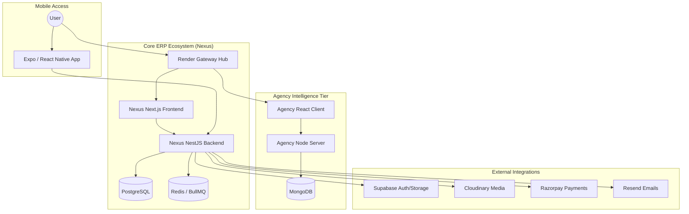

# Klypso Nexus ERP - Sovereign Ecosystem

[](https://github.com/sponsors/Adityavanjre)
[](./LICENSE)
[](./CONTRIBUTING.md)

**Nexus ERP** is a high-integrity, multi-tenant enterprise resource planning system designed for precision manufacturing, automated accounting, and sovereign financial management.

## 🚀 Vision
Built to eliminate operational latency, Nexus ERP fuses live factory nodes with audited financial ledgers, providing a single source of truth for modern industrial fabrication.

## 🛡️ Repository Protection & Governance
This project is protected by the **Klypso Nexus Protection Protocol**.
- **No Direct Pushes**: The `main` branch is protected. All changes must be routed through independent feature branches and reviewed via Pull Request.
- **Strict Licensing**: This is a proprietary project. Clones or forks for unauthorized redistribution or personal claims are prohibited. See [LICENSE](./LICENSE) for details.

## 🏗️ Architecture Overview

The Klypso ecosystem is a multi-tier monorepo architecture designed for high-availability and extreme data integrity.



## 🛠️ Installation & Setup

Follow these steps to initialize the full sovereign environment locally.

### 1. Prerequisites
- **Node.js**: v18.0.0+
- **Database**: PostgreSQL (Prisma), Redis, and MongoDB.
- **Tools**: `npm` or `yarn`.

### 2. Global Initialization
```bash
# Install root dependencies
npm install

# Build shared packages
npm run build:shared
```

### 3. Service Configuration
#### Nexus Backend
```bash
cd nexus/backend
cp .env.example .env
# Populate DATABASE_URL, REDIS_HOST, etc.
npx prisma generate
npx prisma migrate dev
```

#### Nexus Frontend
```bash
cd nexus/frontend
cp .env.local.example .env.local
```

### 4. Launching the Cockpit
```bash
# Start everything (Nexus + Agency)
npm run start:all

# Start only ERP
npm run start:nexus
```

## 💎 Support the Evolution
Fuel the hardware scaling and research for Project-K. Your support ensures the sovereignty of this engineering partner.

| Platform | Link |
| :--- | :--- |
| **GitHub Sponsors** | [Sponsor Adityavanjre](https://github.com/sponsors/Adityavanjre) |
| **Ko-fi** | [Support on Ko-fi](https://ko-fi.com/adityavanjre) |
| **LinkedIn** | [In/aditya-vanjre](https://www.linkedin.com/in/aditya-vanjre) |
| **X (Twitter)** | [@adityavanjre](https://x.com/adityavanjre) |

## 🤝 Contribution Protocol
Interested in hardening the core or adding a vertical? Please read our [CONTRIBUTING.md](./CONTRIBUTING.md) before submitting any Pull Requests.

---
🛡️ *Klypso Nexus: Audited. Sovereign. Eternal.*
