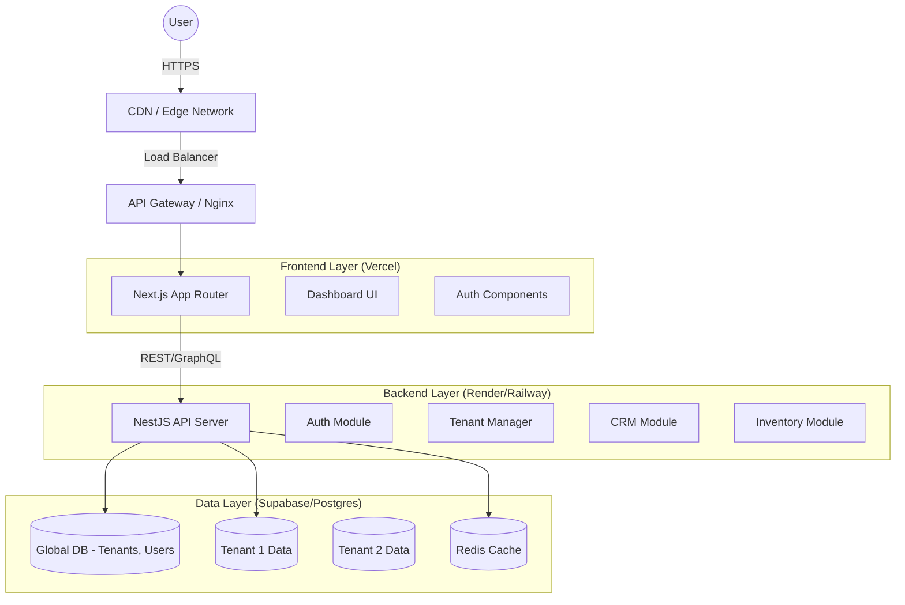

# 🏗 Enterprise SaaS ERP Architecture Design

## 1. Executive Summary
This document outlines the architecture for a modular, multi-tenant SaaS ERP system designed to serve diverse industries (Manufacturing, Retail, Healthcare, etc.). The system prioritizes scalability, security, and a premium "wow" factor for user experience.

## 2. Technology Stack & Core Infrastructure

### Frontend (Client-Side)
- **Framework**: Next.js 14+ (App Router)
- **Language**: TypeScript
- **Styling**: Tailwind CSS + ShadCN UI (Radix Primitives) + Framer Motion (Animations)
- **State Management**: Zustand (Global), React Query (Server State)
- **Forms**: React Hook Form + Zod (Validation)
- **Charts**: Recharts or Tremor

### Backend (Server-Side)
- **Framework**: NestJS (Modular, Dependency Injection)
- **Language**: TypeScript
- **API**: REST + GraphQL (Hybrid)
- **ORM**: Prisma (Type-safe database access)
- **Validation**: class-validator + class-transformer
- **Documentation**: Swagger / OpenAPI

### Database & Storage
- **Primary DB**: PostgreSQL (Supabase / Managed Postgres) -> Multi-Schema or Row-Level Isolation
- **Caching**: Redis (BullMQ for queues)
- **Storage**: Supabase Storage / AWS S3

### Infrastructure & DevOps
- **Containerization**: Docker
- **Orchestration**: Kubernetes ready (Initial deployment via Render/Railway)
- **CI/CD**: GitHub Actions

---

## 3. High-Level Architecture Diagram

## 4. Multi-Tenancy Strategy
We will implement a **Hybrid Multi-Tenancy** approach:
1.  **Shared Database, Schema-per-Tenant (Ideal Enterprise)**: Uses Postgres Schemas (`tenant_id.table`).
2.  **Shared Database, Row-Level Isolation (MVP / Free Tier)**: All data in one schema, but every table has a `tenant_id` column. RLS (Row Level Security) enforce isolation.

*Code defaults to Row-Level Isolation for MVP ease on Supabase Free Tier.*

## 5. Module Architecture
Each module (CRM, Inventory, HRM) will follow "Clean Architecture":
- **Domain Layer**: Entities and Business Logic.
- **Application Layer**: Use Cases / Services.
- **Infrastructure Layer**: Repositories, Database Adapters.
- **Presentation Layer**: Controllers / Resolvers.

## 6. Security Implementation
- **Authentication**: Usage of Supabase Auth (JWT) or Custom NestJS JWT Strategy.
- **RBAC**: `@Roles()` decorator in NestJS guarding endpoints.
- **Audit Logs**: Middleware interceptor logging every write action with `user_id`, `tenant_id`, `action`, `payload`.

## 7. Roadmap Phase 1 (MVP)
1.  **Setup Monorepo**: `apps/web` (Next.js), `apps/api` (NestJS).
2.  **Database**: Setup Prisma with `User`, `Tenant`, `Role` models.
3.  **Auth**: Login/Register flow with JWT.
4.  **Dashboard**: Basic ShadCN shell with Dark Mode.

---
**Status**: Architecture Defined. Proceeding to implementation.
